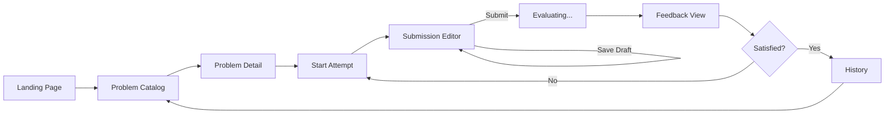
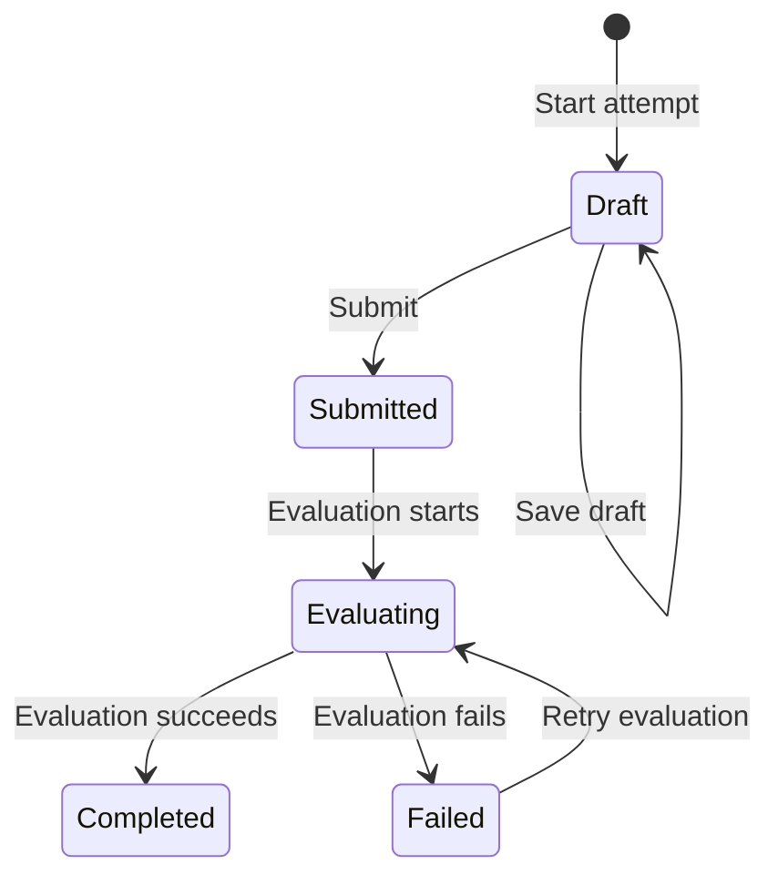
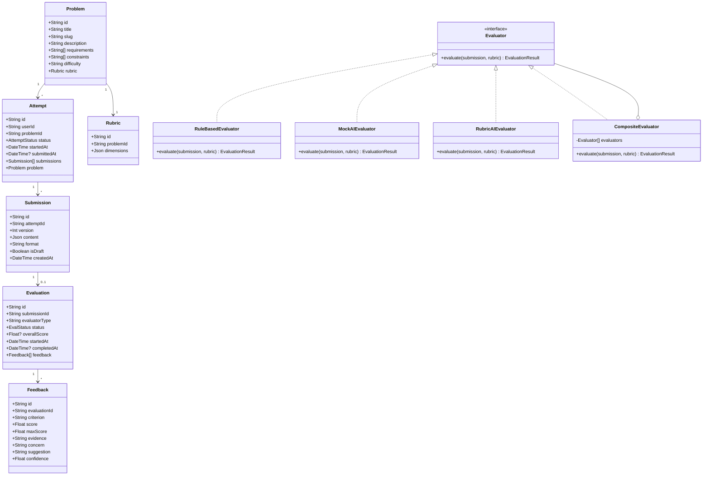
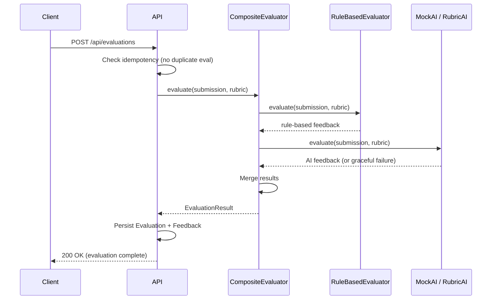

# Design Note: DesignForge — LLD Practice Platform

**Author:** Utkarsh Kumar  
**Date:** 10-09-2026  
**Status:** MVP Design — 2-Day Engineering Assignment

---

## 1. MVP Scope

The MVP delivers a single, complete practice loop: a learner picks a problem, writes a design, submits it, receives structured feedback, and can retry to improve. Three curated problems are included. Authentication is a simple demo login. The evaluator is a pluggable composite of rule-based and AI-assisted checks, with a mock AI evaluator as the default (no API key required).

**Out of scope:** LMS features, multi-user management, diagram/code submission formats, deployment infrastructure, and production-grade auth.

---

## 2. User Flow



**State transitions for an Attempt:**



---

## 3. Domain Model

### 3.1 Class Diagram



### 3.2 Key Design Decisions

**1. `Evaluator` as an interface (Strategy pattern)**

The `Evaluator` interface defines a single `evaluate(submission, rubric) → EvaluationResult` contract. Concrete implementations — `RuleBasedEvaluator`, `MockAIEvaluator`, `RubricAIEvaluator` — can be swapped or composed without touching the Attempt/Submission flow. The `CompositeEvaluator` orchestrates multiple evaluators and merges their results.

*Why:* The assignment specifically requires demonstrating that the evaluator is "genuinely swappable." This pattern also enables future extensibility — a `HumanEvaluator`, `PeerEvaluator`, or `StaticAnalysisEvaluator` can be added by implementing the interface, with zero changes to the practice flow.

**2. `Submission` is immutable and versioned**

Each save creates a new `Submission` record with an incremented `version` field. Previous versions are never mutated. Drafts are distinguished by an `isDraft` boolean.

*Why:* Immutability is what makes attempt history meaningful. A learner can compare v1 → v3 of their design and see concrete improvement. Mutation would destroy this audit trail. The versioning model also naturally supports the "draft → final" workflow without special state management.

**3. `Evaluation` has an independent lifecycle**

`Evaluation` owns its own status (`Pending → Running → Completed → Failed`) separate from `Attempt`. Evaluation has an explicit lifecycle even though the MVP executes evaluation synchronously within the API request. This keeps the domain model ready for future background-worker processing without adding unnecessary infrastructure (like Redis or BullMQ) to the prototype. An evaluation failure doesn't corrupt or block the submission.

*Why:* AI evaluation is inherently slower and externally dependent (API timeouts, rate limits). Decoupling evaluation from submission means: (a) the submission is safely persisted before evaluation begins, (b) a failed evaluation can be retried without re-submitting, and (c) the architecture is queue-ready for asynchronous background execution as load scales.

**4. Problem-specific rubrics**

Each `Problem` has its own `Rubric` with tailored dimensions and weights. A Parking Lot problem weights "vehicle type polymorphism" and "spot allocation strategy"; an Elevator problem weights "state machine design" and "request scheduling."

*Why:* Generic rubrics produce generic feedback. The assignment's success metric requires "differentiated, evidence-based" feedback for different solutions. Problem-specific dimensions are necessary to produce useful, targeted feedback rather than boilerplate.

---

## 4. Evaluation Approach

### 4.1 Split: Deterministic vs. Judgment-Based

| Layer | What it checks | Implementation |
|-------|---------------|----------------|
| **Deterministic (rule-based)** | Required sections present, structural completeness, minimum class count, relationship density, valid state transitions | `RuleBasedEvaluator` — pure logic, no external dependencies |
| **Judgment-based (AI-assisted)** | Quality of class responsibilities, SOLID principle adherence, abstraction quality, trade-off reasoning, improvement suggestions | `MockAIEvaluator` (default) or `RubricAIEvaluator` (opt-in) |

### 4.2 Feedback Structure

Each dimension produces structured output:

```json
{
  "criterion": "Responsibility Clarity",
  "score": 7,
  "maxScore": 10,
  "evidence": "ParkingLot class handles both spot management and fee calculation",
  "concern": "Single class owns two distinct responsibilities (SRP violation)",
  "suggestion": "Extract a FeeCalculator or PricingStrategy class",
  "confidence": 0.85
}
```

This ensures feedback is evidence-linked, actionable, and consistent across runs — not a vague "good job" or an opaque numeric score.

### 4.3 Composite Evaluation Flow



**Graceful degradation:** If the AI evaluator fails, the composite still returns rule-based results with the evaluation marked as `Partial`. The learner always gets *some* feedback.

---

## 5. API Design

| Method | Endpoint | Description |
|--------|----------|-------------|
| `GET` | `/api/problems` | List all problems |
| `GET` | `/api/problems/[id]` | Problem detail + rubric |
| `POST` | `/api/attempts` | Start new attempt (demo user) |
| `GET` | `/api/attempts?problemId=X` | List attempts for a problem |
| `GET` | `/api/attempts/[id]` | Attempt with submissions + evaluations |
| `POST` | `/api/submissions` | Save draft or final submission |
| `POST` | `/api/evaluations` | Trigger evaluation (idempotent) |
| `GET` | `/api/evaluations/[id]` | Evaluation status + feedback |
| `GET` | `/api/history` | All attempts with feedback trends |

**Idempotency:** `POST /api/evaluations` checks for an existing `Pending`/`Running` evaluation for the submission before creating a new one. This prevents duplicate evaluations on double-click or retry.

---

## 6. Trade-off Decisions

| Decision | Chosen | Rejected | Rationale |
|----------|--------|----------|-----------|
| Submission format | Structured text | Diagrams, full code | Diagrams need a rendering UI; code needs a compiler/sandbox. Text exposes design reasoning directly — the thing being evaluated. |
| Auth | Demo login | OAuth / session-based | 2-day prototype — evaluators assess LLD quality, not auth implementation. |
| Database | SQLite (via Prisma) | MongoDB Atlas, PostgreSQL | Zero-setup local development. Prisma abstracts the DB, so switching later is trivial. |
| AI evaluator | Mock (default) | Always-on AI | Works without API key. Architecture proves the Strategy pattern regardless. |
| Frontend | Clean functional | Glassmorphism / heavy animation | Time budget goes to evaluation quality and tests, not visual polish. |
| Problem count | 3 | 5+ | Enough to demonstrate the loop. Less content authoring burden. |
| Rubric | Problem-specific | Generic | Required for differentiated, evidence-based feedback. |

---

## 7. Reliability Considerations

1. **Submission persisted before evaluation** — a failed evaluator never loses learner work.
2. **Evaluation has an explicit lifecycle (Pending → Running → Completed/Failed)** — even though the MVP executes evaluation synchronously within the API request, this decoupling keeps the domain model ready for future background-worker queueing without adding unnecessary infrastructure to the prototype.
3. **Idempotent evaluation trigger** — duplicate requests don't create duplicate evaluations.
4. **Immutable submissions** — version history is never corrupted by subsequent attempts.
5. **Future scale note:** The evaluation worker is the first component to extract from the monolith if load grows, since it's the slowest and most externally-dependent piece.
